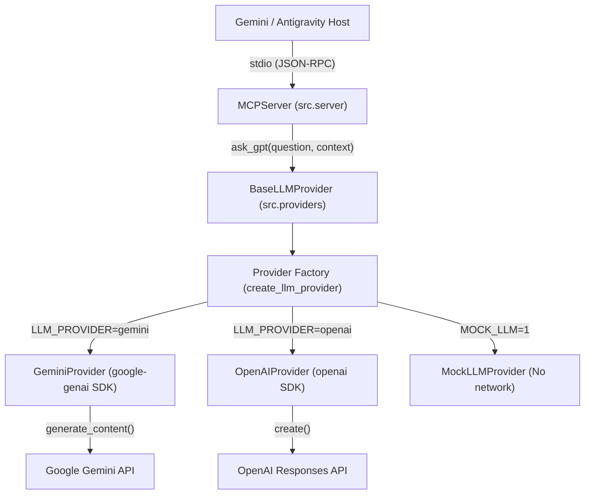

# AI Agent Bridge

## Project Purpose
`ai-agent-bridge` serves as an extensible Model Context Protocol (MCP) bridge enabling Gemini / Google Antigravity to communicate with underlying Large Language Models (LLMs) via an extensible provider abstraction over MCP stdio tools.

The bridge supports explicit provider selection:
- **Gemini**: Using the official `google-genai` SDK (`GeminiProvider`).
- **OpenAI**: Using the `openai` SDK (`OpenAIProvider`).
- **Mock**: For zero-cost, network-free integration verification (`MockLLMProvider`).

Currently in Milestone 2, the workflow is strictly:
```text
Gemini / Antigravity Host → MCP (stdio) → ask_gpt() → LLM Provider → Model Response → Gemini Host
```
There is **no** autonomous agent loop or multi-agent orchestration in this milestone.

---

## Architecture Diagram



---

## Requirements
* Python 3.10+ (Tested on Python 3.13.5)
* Windows / Linux / macOS
* Dependencies (pinned in `requirements.txt`):
  * `google-genai==2.28.0`
  * `mcp==2.2.0`
  * `openai==3.20.0`
  * `pytest==9.1.1`

---

## Environment Variables
The application reads configuration from standard environment variables (do **not** commit actual secrets):

| Variable | Description | Default / Example |
|---|---|---|
| `LLM_PROVIDER` | Explicit provider choice: `gemini`, `openai`, or `mock` | `gemini` |
| `LLM_MODEL` | Unified model identifier | `gemini-2.5-flash` or `gpt-4o-mini` |
| `GEMINI_API_KEY` | Google Gemini API key (required if `LLM_PROVIDER=gemini`) | - |
| `GEMINI_MODEL` | Fallback model identifier for Gemini | - |
| `OPENAI_API_KEY` | OpenAI API key (required if `LLM_PROVIDER=openai`) | - |
| `OPENAI_MODEL` | Fallback model identifier for OpenAI (backward-compatible) | - |
| `MOCK_LLM` | Set to `1` to force mock mode regardless of configured keys | `0` |
| `MOCK_GPT` | Legacy alias for `MOCK_LLM=1` | `0` |

Refer to [.env.example](file:///C:/Project/ai-agent-bridge/.env.example) for a template.

---

## Provider Selection Priority
1. **Mock Mode**: If `MOCK_LLM=1` or `MOCK_GPT=1`, `MockLLMProvider` is returned immediately.
2. **Explicit Provider**: If `LLM_PROVIDER` is set, the requested provider is instantiated (`gemini`, `openai`, or `mock`). If invalid, a clear `LLMProviderError` is raised.
3. **Legacy Fallback**: If `LLM_PROVIDER` is unset, but legacy `OPENAI_API_KEY` or `OPENAI_MODEL` is present, it safely defaults to `OpenAIProvider` to maintain 100% backward compatibility with existing tests.
4. **Configuration Error**: If no provider is specified and no legacy variables exist, a safe `LLMProviderError` is raised with actionable setup instructions.

---

## How to Install

1. Create a Python virtual environment:
   ```powershell
   python -m venv .venv
   ```

2. Activate the virtual environment:
   * Windows (PowerShell):
     ```powershell
     .\.venv\Scripts\Activate.ps1
     ```
   * Linux / macOS:
     ```bash
     source .venv/bin/activate
     ```

3. Install dependencies:
   ```powershell
   pip install -r requirements.txt
   ```

---

## How to Run Local MCP Server

Run the MCP server as a Python module from the project root:

```powershell
.\.venv\Scripts\python.exe -m src.server
```

*(Or after activating `.venv`: `python -m src.server`)*

---

## How to Run Tests

Run the test suite using `pytest`:

```powershell
.\.venv\Scripts\pytest.exe -v
```

---


## Known Limitations
* **Single Public Tool**: `ask_gpt` is retained as the public MCP tool name for backward compatibility across all providers.
* **No Autonomous Loop**: Operates purely as a reactive tool invoked by the host; does not execute self-directed agent loops.
* **No Multi-Agent Orchestration**: No multi-agent coordination, routing, or agent-to-agent communication.
* **No Persistence / UI**: No database, vector store, frontend, or Docker containerization.
